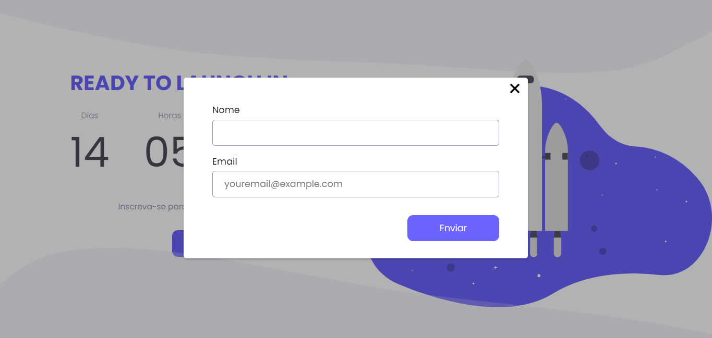

<h1 align="center">
  🚀  <a href="#"> Coming Soon </a>
</h1>

## Result

  

  

 <a href="#about">About</a> •
 <a href="#tech-stack">Tech Stack</a>

---

## About

The project is a solution to a challenge from Rockeseat Discover course and had the following requirements:

  <ul>
    <li>A countdown timer</li>
    <li>A subscribe button</li>
  </ul>

Link to Challenge: https://efficient-sloth-d85.notion.site/Desafio-Countdown-4572ce6f5c91469abe0171f454a13e3f

## Tech Stack

- HTML
- CSS
- JavaScript
<!-- --- -->

<!-- ## License

This project is under the license [MIT](./LICENSE).

Made with love by Thiago Marinho 👋🏽 [Get in Touch!](Https://www.linkedin.com/in/tgmarinho/) -->
